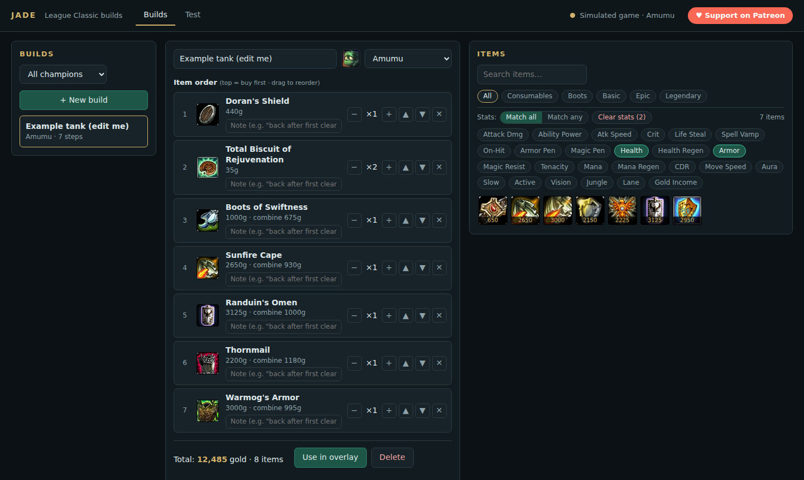
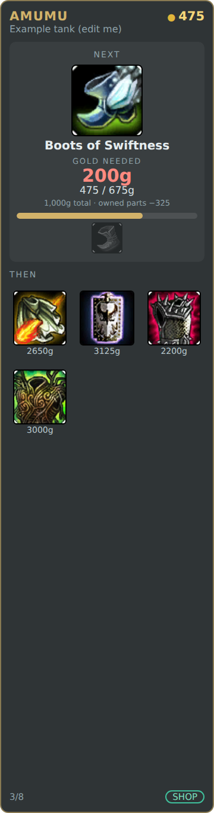

<h1 align="center">Jade — League Classic Build Overlay</h1>

<p align="center">
  <b>A free item build guide editor and in-game "next item" overlay for League of Legends: League Classic (codename <i>Jade</i>).</b><br>
  Plan your item order in a local web app, then see your next item, your gold, and exactly how much gold you still need — right on your game screen.
</p>

<p align="center">
  <a href="https://www.patreon.com/c/LazyLoafs504">
    
  </a>
</p>

<p align="center">
  <a href="https://github.com/lazyloafs/League-Classic-Jade-Build-Overlay/releases/latest"></a>
  
  
  
  
</p>

<p align="center">
  <a href="#quick-start">Quick start</a> ·
  <a href="#features">Features</a> ·
  <a href="#how-the-overlay-works">How it works</a> ·
  <a href="#faq">FAQ</a> ·
  <a href="https://www.patreon.com/c/LazyLoafs504">Support</a>
</p>

---

## What is Jade?

**Jade** is an unofficial **League Classic item build tool** for the Season&nbsp;3-style *League Classic* game mode. It has two parts that share one local server:

1. **Build editor (web app):** create item build guides like on a champion guide site. Pick a champion, click items to add them in buy order, drag to reorder, add notes. Filter the item catalog by **multiple stats at once** (for example *Armor + Health* or *Ability Power + Mana Regen*).
2. **In-game overlay:** a slim strip on the left edge of your game that reads your gold and inventory live and shows your **next item to buy**, what you already own toward it, and the **gold needed** to finish it.

<p align="center">
  
</p>

## Features

- **Next-item overlay** — always shows the next unfinished item in your selected build, with a progress bar.
- **"Gold needed" readout** — how much more gold you need, your gold against the item's cost, and the total price with the discount from components you already own.
- **Recipe-aware** — counts owned components toward a bigger item (the shop deducts them), never counts one component twice, and suggests the best component you can afford right now when you can't afford the whole item.
- **Multi-stat item filter** — toggle several stats and choose *Match all* or *Match any*; combine with Consumables, Boots, Basic, Epic and Legendary.
- **Optimizer tab** — six sliders (Magic EHP, Armor EHP, DPS with crit, DPS without crit, Ability Power, Cooldown Reduction) say what you want; Jade searches every legal 3-6 item build with a multi-objective genetic algorithm, ranks the best for your mix, and saves any result as a build. Runs in your browser, no server needed.
- **Item tooltips and recipes** — hover any item for its description, cost, combine cost, and what it builds from and into.
- **Drag-and-drop build order** with counts (for example 2× Total Biscuit) and per-step notes. Builds autosave as plain JSON files.
- **Shop mode click-to-copy** — when you're at the shop, click an item in the overlay to copy its name, then paste it in the shop search.
- **Test tab** — simulate a match (gold, inventory, dead/alive, game time) to see the overlay react without playing.
- **Free and local** — runs entirely on your PC. No account, no telemetry.

<p align="center">
  
</p>

## Quick start

**Requirements:** Windows, and League of Legends set to **Borderless** window mode (overlays can't draw over exclusive fullscreen).

### Option 1: Installer or portable app (recommended, no Node.js needed)

1. Download from the [**Releases page**](https://github.com/lazyloafs/League-Classic-Jade-Build-Overlay/releases/latest):
   - **`Jade-Overlay-Setup-x.y.z.exe`** installs it with a desktop shortcut, or
   - **`Jade-Overlay-Portable-x.y.z.exe`** runs from anywhere with no install.
2. Run it. On first launch the build editor opens in your browser, and Jade Overlay lives in your system tray (right-click it for the menu).
3. In the editor, create a build for your champion and press **Use in overlay**.
4. Start a League Classic match. The overlay appears on the left of your game.

> Windows may show a "Windows protected your PC" (SmartScreen) message because the app isn't code-signed. Click **More info**, then **Run anyway**. You can inspect everything: the source is in this repo, and the `.exe` is built from it by GitHub Actions.

### Option 2: Run from source

Needs [Node.js 20+](https://nodejs.org).

```bash
git clone https://github.com/lazyloafs/League-Classic-Jade-Build-Overlay.git
cd League-Classic-Jade-Build-Overlay
npm install
npm start
```

Or unzip a source release and double-click **`start.bat`**. Only want the editor? Run `npm run web` and open `http://127.0.0.1:17600`. Want to try it without a match? Run `npm run mock` or use the **Test** tab.

To build the installer yourself: `npm run dist` (output in `dist/`).

## Hotkeys

Change any of these in `config.json` (in your builds/settings folder, created on first run). The tray icon menu has the same actions.

| Key | Action |
| --- | --- |
| `F8` | Toggle manual **shop mode** (makes the overlay cards clickable) |
| `F9` | **Calibrate**: `Alt`+Arrows moves the strip, `Alt`+`Shift`+Arrows resizes it, `F9` again saves |
| `F10` | Show / hide the overlay |
| `Ctrl`+`Alt`+`Q` | Quit |

## How the overlay works

- Jade reads the in-game **Live Client Data API** (`https://127.0.0.1:2999`), the local endpoint Riot provides while a match is running. In League Classic it reports `gameMode: "JADE"`, your current gold, and your inventory.
- Item costs, recipes, stats and icons come from Riot's **Data Dragon** and **Community Dragon** data (`data/jade-items.json`), covering the League Classic item shop and roster.
- The overlay is a transparent, always-on-top, click-through window. It **only draws on top of the game**. It does not inject into or read the game process, and it never sends clicks or keystrokes to the game.
- The API doesn't report your position, so Jade can't know when you're at the shop. Cards become clickable when you're **dead**, in the **first two minutes**, or after you press **`F8`**. Otherwise the strip is click-through.

## FAQ

**Does Jade work with League Classic?**
Yes, that's what it's built for. It detects the game mode `JADE` and uses the League Classic item list and champions.

**Will clicking an item buy it for me?**
No. Clicking copies the item name so you can paste it into the shop search and buy it yourself. Automatic buying would require simulating input in the game, which Riot's third-party rules generally don't allow, so Jade doesn't do it.

**Is Jade safe to use? Can I get banned?**
Jade only draws on top of the game and reads Riot's documented local Live Client Data API, and it doesn't inject into, read from, or automate the game. Overlays like this are a common category of tool, but Riot's rules can change, and use is at your own risk. Check Riot's current [third-party application policy](https://developer.riotgames.com/policies/general).

**Why doesn't the overlay show up?**
Set League to **Borderless** (Settings → Video → Window Mode). If the strip is in the wrong spot, press `F9` to calibrate it. The overlay only shows live data once you're loaded into a match.

**Do I need to install Node.js?**
Not with the installer or portable `.exe`, which bundle everything. Node.js is only needed to run from source.

**Why does Windows warn about the download?**
The app isn't code-signed (certificates cost money), so SmartScreen shows an "unknown publisher" prompt. Choose *More info*, then *Run anyway*. The source is public and the `.exe` is built from it on GitHub.

**Does it work on Mac or Linux?**
The web app runs anywhere Node runs. The overlay is built and set up for Windows.

**Where are my builds saved?**
As one JSON file per build, so they're easy to back up or share. With the installer or portable app they're in `%APPDATA%\jade-overlay\builds` (tray menu, *Open builds folder*). Running from source, they're in the project's `builds/` folder.

**Can I use it for the regular Summoner's Rift game?**
Jade targets League Classic. In other modes the overlay tells you it isn't League Classic.

## Project layout

```
build/     app icons
server/    engine.js (next-item logic), poller.js (Live Client API), index.js (API + live stream)
web/       build editor
overlay/   overlay strip (UI) + Electron shell
data/      League Classic items, champions, sample game data
builds/    your saved builds
test/      unit tests (npm test)
docs/      screenshots
```

Run the tests with `npm test`.

## Support the project

Jade is free. If it helps your games and you'd like to support its development, you can do that on Patreon:

<p align="center">
  <a href="https://www.patreon.com/c/LazyLoafs504">
    
  </a>
</p>

Bug reports and feature ideas are welcome in [Issues](https://github.com/lazyloafs/League-Classic-Jade-Build-Overlay/issues).

## Keywords

League of Legends, League Classic, LoL Classic, Jade game mode, item build guide, build editor, item build overlay, next item overlay, in-game overlay, gold tracker, shop helper, Season 3 items, Live Client Data API, Data Dragon, Electron overlay, Node.js.

## Disclaimer

Jade isn't endorsed by Riot Games and doesn't reflect the views or opinions of Riot Games or anyone officially involved in producing or managing Riot Games properties. Riot Games and all associated properties are trademarks or registered trademarks of Riot Games, Inc.
